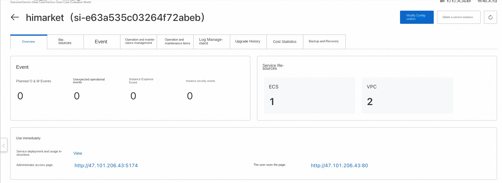
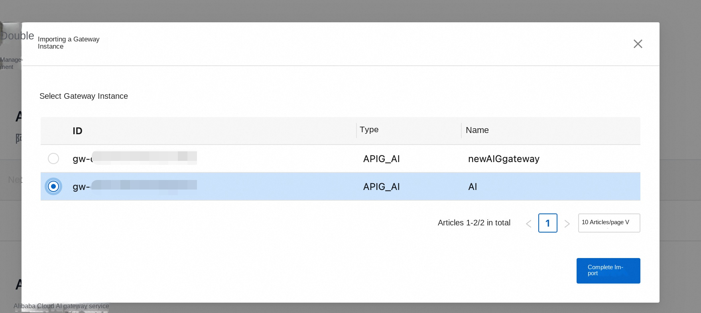
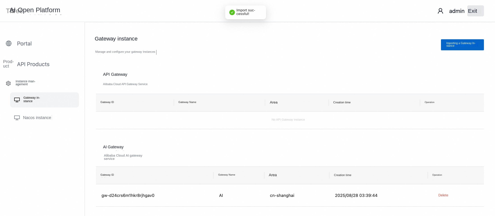
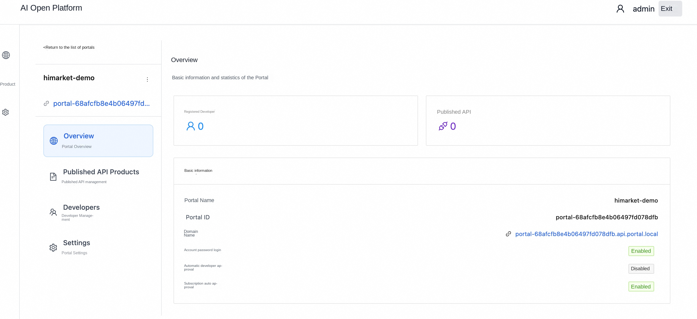
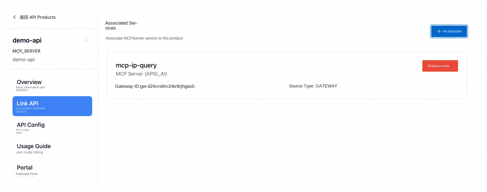

This guide helps users quickly use HiMarket in the computing nest to build a privatized MCP market and help enterprises build AI mid-end.

Github Address:[https://github.com/higress-group/himarket](https://github.com/higress-group/himarket)

##1. deploy HiMarket by computing nest
### HiMarket Project Structure Description
HiMarket currently involves portal-bootstrap(Java back-end), api-portal-admin (back-end front-end) and api-portal-frontend (front-end front-end) three projects, and depends on a Mysql database instance.

### One-click deployment HiMarket
[Create HiMarket AI Open Platform Task in the Computing Nest Console](https://computenest.console.aliyun.com/service/instance/create/cn-hangzhou?type=user&ServiceId=service-a9acee41142746928283&ServiceVersion=beta) can pull up the entire AI open platform environment with one click.

Select the target region and the instance type. Since this scheme includes three applications and a mysql database, it is recommend to use the instance configuration above 2C4G. After configuring the charging method, available area and network configuration, click OK to order and immediately create AI open platform.

Click OK and wait for the instance to be created.

I can see the deployment progress of the instance in my instance

After the deployment is complete, click the instance to obtain the links to access the foreground and background of the AI open platform.

### Replace MySQL instance (optional)
One-click deployment through computing nest is to deploy three projects and mysql instances through ECS. Users can quickly experience the HiMarket MCP mid-end capabilities. If users have further production requirements, they can switch Mysql to the high availability version of RDS instances and only need to replace DB_HOST configuration through environment variables in portal-bootstrap service.

##2. HiMarket background management
### Register Administrator
Visit the administrator access page' http://47.xx.xx.xx:5174 'to register an administrator account for the first time.

### Import an AI Gateway instance
Select [Instance Management]-[Gateway Instance]-[Import Gateway Instance]-[AI Gateway], prepare the AK/SK of the sub-account, select the instance corresponding to the region, and import the AI gateway instance. Take gw-xxx as an example.

It involves the application of the sub-account AK/SK. In order to avoid the risk of leakage, you need to create a sub-account and select the minimum permissions. The relevant permissions are as follows:

APIG read-only permission: APIGReadOnlyAccess
 Metering/Logging/SLS read-only permissions:AliyunLogReadOnlyAccess
APIG Consumer/Policy/Plug-in Operation Related Write Permission

'''json
{
"Version": "1 ",
"Statement ": [
{
"Effect": "Allow ",
"Action ": [
"apig:*Consumer* ",
"apig:*Policy* ",
"apig:*Plugin*"
],
"Resource": "*"
}
]
}
'''

When using AK/SK, pay attention to the risk of AK/SK leakage.

### Create Portal Portal
Select Portal-Create Portal to create a portal named himarket-demo.

Click the portal card to enter the portal configuration, and keep the default options for other configurations. In [Setting]-[Domain Name Management]-[Bind Domain Name], bind a localhost domain name for development self-test. Other menus can be used without attention in the quick start. Here is a brief introduction to their functions:

Published API Products. Manage API Product published in the portal.
Developers. Manage the Developer of the portal and Developer associated Consumer.
Settings.
-Configure the basic information of the portal.
-Control whether the registration approval of the Developer in the portal is automatically approved, and whether the API Product subscription is automatically approved.
-Portal supports three-way login. Supports standard OIDC configurations, such as Aliyun, Google, and Github.

### Create an API Product
Select [API Products]-[Create API Product] to create a demo-api API Product.

The initial status of the API Product is "to be configured", and operations such as Link API and publishing to the portal are required.

### Associated API

The MCP service associated with a gateway. The data source comes from the MCP service management of the AI gateway. API Config also automatically synchronizes the configuration in the AI gateway.

### Usage Guide

You can edit the customized document information in the user guide.

### Publish to Portal
After the API Product is ready, you can choose to publish to the specified portal.

At this point, a Higress MCP Server has been successfully published to the portal.

##3. HiMarket Portal
The portal will have a domain name assigned by default, but the domain name resolution needs to be completed by the user. For example, if the portal-68ac4564bdb292ee9261ff4a.api.portal.local domain name is automatically assigned, it needs to be resolved to the IP address corresponding to the api-portal-frontend (I .e. ** user use page * * address IP'47.xx.xx.xx'), the administrator can manage the domain name of the current foreground Portal in the background [Portal details]-[settings]-[domain name management].

### Registered Developer Developer

Since automatic approval was not turned on in the portal settings before, you need to wait for the administrator to approve the developer in the background after registering the account. After the approval is passed, you can use the registered account to log in at the foreground.

Visit the MCP portal to see the MCP Server just released

 

### Create a Consumer consumer
In the design of AI open platform, consumers Developer represent general user identities, and users need to hold corresponding credentials to apply for subscription to API Product. The concept of credentials is called Consumer consumers in AI open platform, and Developer and Consumer are one-to-many related.

After creating a consumer, you can apply for an API Product subscription.

In the default configuration of the portal, the subscription approval is disabled by default, that is, the developer will automatically approve the subscription after applying.

### Initiate Call
You can call the MCP server by using the consumer's credentials and configuring the connection address of the MCP server in the portal.

